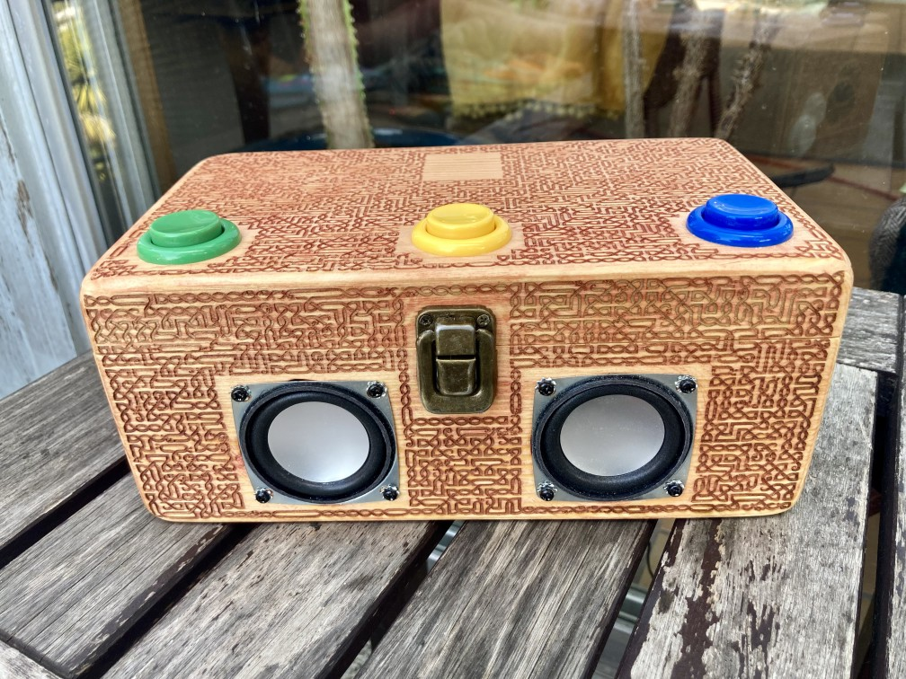

Crabbox is a single-binary RFID & GPIO-controlled jukebox for RaspberryPI

Crabbox is AI-assisted Rust implementation inspired by [RPi-Jukebox-RFID](https://github.com/MiczFlor/RPi-Jukebox-RFID).

## Introduction

Several years ago I have built a jukebox for my son based on [RPi-Jukebox-RFID](https://github.com/MiczFlor/RPi-Jukebox-RFID).

Unfortunately, when SD card completely died I discovered that the  software is stale and doesn't
work even on bookworm (it is already Trixie era at the time of the writing). 
I engaged Codex to recreate the needed functionality from scratch.

## Status

I run this on my son's `Crabbox I` device (see picture below).

## Requirements

Crabbox targets RaspberryPi. 

It is developed on Linux x64 and can be compiled for the pi using cross-rs.

## Features

- GPIO support for player control
- RFID reader support (RC522)
- Named pipe support for command control.
- Web UI for playback control and queue/library visibility.

## Commands, web UI, and control pipe

The player understands the following commands (case-insensitive). They can be sent from the web UI command box, the control pipe, or mapped to RFID tags/buttons:

- `PLAY [glob]` – rebuilds the queue (ordered) and starts playback. Optional glob filter matches full track paths.
- `PLAYPAUSE [glob]` – toggle pause/resume, or start a filtered queue if a glob is provided.
- `SHUFFLE [glob]` – rebuilds a shuffled queue (optionally filtered) and starts playback.
- `STOP` – stop playback and clear the current track.
- `NEXT` / `PREV` – move within the queue and play the next/previous track.
- `VOLUMEUP` / `VOLUMEDOWN` – adjust volume by the configured step.
- `SHUTDOWN` – stop playback, play the shutdown sound if configured, then request system shutdown.

To control via a named pipe:

1. Set `[server].pipe` in your config (e.g. `pipe = "/tmp/crabbox.pipe"`). Crabbox recreates this FIFO on startup.
2. Write one command per line to the pipe, for example:
   - `printf "PLAY\n" > /tmp/crabbox.pipe`
   - `printf "SHUFFLE chill/*\n" > /tmp/crabbox.pipe`
3. Optional globs match full file paths; use them to target genres, folders, or patterns.

### Web UI

- Configure `[server].web` to set the listen address (e.g. `0.0.0.0:8080`), then open that URL in a browser.
- The page shows the current track, queue (with the active track highlighted), and the full library list.
- Buttons provide play, play/pause, stop, next/prev, volume up/down, and shutdown controls.
- The command input accepts any of the commands above, including glob filters.

### RFID and command mapping

- Enable the `rpi` feature and configure `[rfid]` with your RC522 pins (`bus`, `irq`, optional `reset`).
- Map tag IDs to command strings under top-level `[tags]`, e.g. `0A1B2C3D = "PLAY"`, `ABCD1234 = "SHUFFLE kids/*"`.
- RFID tags can trigger the same commands as the pipe or web UI; filters/globs work the same way. The last seen tag is shown on the web UI.

## Configuration
- Create a TOML config file (see `config.toml` for an example) and point the service to it. At minimum you need one `[[music]]` directory and a `[server]` section.
- Build the binary with `cargo build --release`; the service example below assumes the binary lives at `target/release/crabbox`.
- Key fields:
  - `[server].web` — listen address for the web UI/API.
  - `[server].pipe` — FIFO path for local command control (set to `null` to disable).
  - `[server].startup_sound` / `[server].shutdown_sound` — optional sounds to play on boot/shutdown.
  - `[rfid]` — RC522 wiring (requires the `rpi` feature).
  - `[tags]` — global tag-to-command mappings (used by RFID or other tag sources).
  - `[gpio]` — all pins are optional; set the ones you wire (leave unset to disable GPIO input entirely).

## Building

- Native dev builds: `cargo check`, `cargo test`, and `cargo run -- server <config>` (see Justfile targets `check`, `test`, `server`).
- Install native audio deps once on Debian/Ubuntu: `sudo apt-get install libasound2-dev`.
- Cross-compiling for Raspberry Pi (aarch64):
  1. Install cross: `cargo install --locked cross`.
  2. Build: `cross build --target aarch64-unknown-linux-gnu --features rpi --release` (see `just build-rpi`).
  3. The resulting binary lives at `target/aarch64-unknown-linux-gnu/release/crabbox`.

## Run as a systemd user service
Place a unit file at `~/.config/systemd/user/crabbox.service` (create the directory if it does not exist):

```
[Unit]
Description=Crabbox service
After=network-online.target
Wants=network-online.target

[Service]
ExecStart=crabbox server /home/USER/.config/crabbox/config.toml
WorkingDirectory=/home/USER/crabbox
Restart=always
Environment=RUST_LOG=info

[Install]
WantedBy=default.target
```

- Replace `/home/USER/...` with the actual paths to your checkout, binary, and config.
- Reload systemd and start the service: `systemctl --user daemon-reload` then `systemctl --user enable --now crabbox.service`.
- View logs with `journalctl --user -u crabbox -f`. Stop or restart with `systemctl --user stop|restart crabbox.service`.
- To have the user service start at boot without logging in, enable lingering once: `loginctl enable-linger $USER`.

# Contributing

AI-assisted code is welcome, with fiew common caveats:

- no huge PRs
- you read the code and verify it does what you asked it to

# Crabbox I


